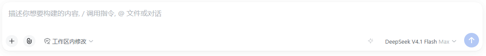
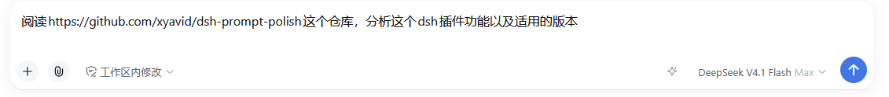
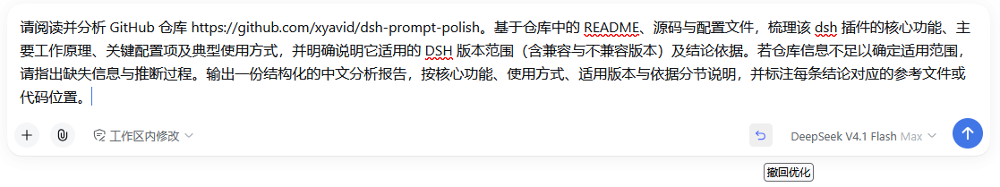
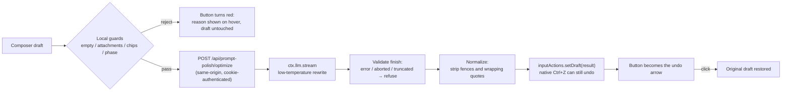

# dsh-prompt-polish

[](https://github.com/xyavid/dsh-prompt-polish/actions/workflows/ci.yml)
[](https://www.npmjs.com/package/@xyavid/dsh-prompt-polish)
[](./LICENSE)
[](https://github.com/deepseek-ai/deepseek-harness)

**Prompt polishing for the [DeepSeek Harness](https://github.com/deepseek-ai/deepseek-harness) web GUI** — one click turns a rough composer draft into a clearer, more actionable prompt: explicit goal, concrete requirements, constraints, and acceptance criteria. The button sits right next to the model name, calls the model your session already uses, writes the result straight back into the composer, and then turns into an undo arrow.

English | [简体中文](./README.zh-CN.md)

---

## Why

A prompt that a coding agent can act on usually states *what to build*, *where*, *under what constraints*, and *how success is judged*. Most drafts don't — they are quick notes. This plugin adds a **polish affordance** to the dsh composer: it sends the draft through a low-temperature rewrite pass over the harness's own LLM service, fills the improved text back, and keeps the original one click away.

Nothing about your intent changes: the strategy is allowed to make the ask clearer, never to invent requirements. Your API key never reaches the browser, and no part of the flow touches the session's model history.

## Features

| | |
|---|---|
| ✨ **Composer button** | A small sparkle button in the composer tool row, immediately left of the model name — always at hand, and it reflows with the row |
| 🔁 **Three states, one button** | Idle (sparkle) → click to polish. Running (spinner) → click to cancel. Done (undo arrow) → click to restore the original draft. No extra panels, bars, or dialogs |
| 🧠 **Your session's model** | The call goes through `ctx.llm` on the route your session already uses, falling back to the harness-wide default model (`agent-default-model`) — no second model to configure, no separate key |
| 🔑 **Zero credential setup** | Calls ride the harness LLM service; keys come from the harness credential store and are used host-side only |
| 🛡️ **Draft safety** | Empty, attachment-only, over-length, and command/reference-chip drafts are refused up front; a failed call never modifies what you typed |
| ↩️ **Two kinds of undo** | Native `Ctrl+Z` (the write goes through the official editor API) and the button's own undo state |
| ⚙️ **Live settings** | `enabled`, strength, temperature, token and length budgets, timeout, and the strategy prompt apply from Settings → 插件配置 with no restart |
| 🌏 **Language follows the draft** | Chinese in → Chinese out, English in → English out; code, paths, identifiers, and error text are preserved verbatim |
| 🚫 **No fabrication** | Expression-level rewriting only: no new requirements, no invented facts, no technology choices you did not imply |
| 🩺 **Runtime diagnostics** | Client state is exposed on `window.__dshPromptPolish` (`stage` / `attempts` / `mounted` / `errors`) for one-command troubleshooting |

> **UI copy is Chinese-only in this version** (button tooltips such as `优化提示词` / `取消优化` / `撤回优化`,
> and the local-guard hints). Hooking into the harness locale namespace for zh/en dictionaries is on the
> roadmap; the settings section itself is described in Chinese because it renders the schema descriptions.

> Screenshots are in [Feature showcase](#feature-showcase) below; `docs/compatibility.md` records what
> was field-verified on which build.

## Feature showcase

**The button, in place.** The sparkle button lives in the composer tool row, immediately left of the model name, so polishing never takes you away from the draft you are writing.



**Before.** A quick note rather than a task brief: the goal, the constraints, and the acceptance criteria are all left implicit.



**After.** One click rewrites it into a structured, actionable prompt and writes the result straight back into the composer; the button then turns into the undo arrow.



## How it works



The plugin is **one npm package with two halves**, following the dsh plugin conventions:

- **Host half** (`exports "."`, Node): registers the `prompt-polish` settings namespace (schemastery — rendered automatically by the built-in plugin config page) and the `POST /api/prompt-polish/optimize` route on the shared webserver. The model call uses `ctx.llm.stream` with the auxiliary-call discipline the harness applies to session titles: composed deadline plus caller cancellation rechecked during and after the stream, terminal-finish validation, and refusal of truncated output.
- **Browser half** (`exports "./client"`, loaded through `dsh.client`): registers the button into the `conversation.input.right` slot, reads the draft with `useInput`, writes it with `inputActions.setDraft`, renders the three button states, and mirrors `undoWindowMs` through `ctx.settingsScope`. It consumes exactly two services — `slots` and (optionally) `settingsScope` — and never renders custom inject-face hooks; see [docs/compatibility.md](./docs/compatibility.md) for why that distinction matters. `dsh.client.inject` is intentionally empty: it lists *client-package* dependencies for graph ordering, and this bundle has none.

The two halves never share code at runtime: the browser half receives only the wire types and the prompt normalization helper, and the host half does all credential-bearing work.

## Requirements

| | |
|---|---|
| dsh | `>= 0.1.5-rc.1` (verified on `0.1.5-rc.1`) |
| Profile | `web` — the desktop app and `dsh web` share this profile |
| Node | `^22.19.0 \|\| >=24.0.0` (only for building from source) |
| Plugin | `0.2.x` |

The host half declares `inject: ['llm', 'settings']`; `webServer`, `sessions`, and the default-model namespace are probed optionally and degrade gracefully when absent.

## Install

**From npm (recommended).** The published tarball already contains the built `lib/`, and registry
installs run no lifecycle scripts:

```bash
dsh plugin --profile web add @xyavid/dsh-prompt-polish
```

**From a local checkout.** The built `lib/` is committed, so a checkout is usable as-is:

```bash
git clone https://github.com/xyavid/dsh-prompt-polish.git
cd dsh-prompt-polish
dsh plugin --profile web add .
```

To develop against a live checkout, build first and link the directory instead:

```bash
pnpm install
pnpm run build
dsh plugin --profile web add link:C:\path\to\dsh-prompt-polish
```

**From a tarball.** No build environment needed:

```bash
pnpm pack                        # produces xyavid-dsh-prompt-polish-0.2.0.tgz
dsh plugin --profile web add ./xyavid-dsh-prompt-polish-0.2.0.tgz
```

**From GitHub.** The package declares a `prepare` script, and pnpm >= 10 blocks dependency build
scripts by default, so a git install has to be allowlisted first; without it pnpm aborts with
`ERR_PNPM_GIT_DEP_PREPARE_NOT_ALLOWED`. Add this to the profile's `pnpm-workspace.yaml`
(`$DSH_HOME/profiles/web/`):

```yaml
onlyBuiltDependencies:
  - "@xyavid/dsh-prompt-polish"
```

```bash
dsh plugin --profile web add github:xyavid/dsh-prompt-polish
# or pin a commit for reproducibility:
dsh plugin --profile web add github:xyavid/dsh-prompt-polish#<sha>
```

**Uninstall:**

```bash
dsh plugin --profile web remove @xyavid/dsh-prompt-polish
# then restart dsh web
```

`dsh plugin add` appends the bundle to `dsh.profile.bundles` automatically (the package declares `dsh.bundle.patch`); `remove` takes it back out. After either operation the running profile keeps its startup bundle set, so **restart** before expecting a change.

## Usage

Type a draft, then click the sparkle button left of the model name.

**The three states**

| State | Icon | Click behaviour | Hover text |
|---|---|---|---|
| Idle | ✦ sparkle | start polishing | `优化提示词` |
| Running | ↻ spinner (hover turns red) | cancel the in-flight call | `取消优化` |
| Done | ↺ undo arrow (accent colour) | restore the original draft | `撤回优化` |

**What happens, step by step**

1. **Local guards run first.** Empty or whitespace-only drafts, attachment-only drafts (a chip's trailing zero-width space is folded away correctly), drafts over `maxInputChars`, drafts containing `/commands` or `@references`, and a composer in a non-`plain` phase are refused with a tooltip. Chips are refused because filling text back would destroy them.
2. **The button spins while the host calls the model.** Your draft is untouched during the call, so cancelling at any moment leaves exactly what you typed.
3. **On success the result is written back** through the official editor API, the native undo stack stays intact (`Ctrl+Z` works), and the same button becomes the undo arrow.
4. **Undo restores the original draft** and returns the button to idle. If you keep typing after the result lands, the undo state retires itself so stale text can never overwrite your newer edits.

**Interaction rules worth knowing**

- Pressing send while a polish is running cancels the call and sends your original text.
- Editing the draft while a polish is running means the result is **not** written back; the button returns to idle and the hover text explains why.
- The undo affordance expires after `undoWindowMs` (default 60 s). The button reads that value through the client settings mirror, and falls back to 60 s when the mirror is unavailable (see Known limitations).
- Only one polish runs at a time per session, and a late response from a cancelled call is discarded.

## Configuration

Everything lives in the `prompt-polish` settings namespace, editable from **Settings → 插件配置** or directly in `~/.dsh/settings.yaml`. Changes are applied live (`applies: 'live'`).

Defaults come from two places, in this order: the schema defaults below, overridden by the composition layer's `config` block in `cordis.patch.yml`, overridden by your settings section. Out of the box the composition layer pins `enabled`, `temperature`, `maxOutputTokens`, `timeoutMs`, and `maxInputChars`, so those five values are the effective defaults even if you never open the settings page.

| Field | Default | Applies | Description |
|---|---|---|---|
| `enabled` | `true` | live | Master switch; off hides the button and disables the route |
| `strength` | `balanced` | next call | `conservative` — fix and structure only; `balanced` — also fill in implicit prerequisites; `aggressive` — rewrite as a full task brief (length ceiling relaxed to ~1500 characters) |
| `temperature` | `0.3` | next call | Lower keeps the rewrite more faithful to the original |
| `maxOutputTokens` | `2048` | next call | Output budget of one call; **truncated output is refused**, never written back, so raise this when using `aggressive` with reasoning enabled |
| `maxInputChars` | `12000` | next call | Input cap counted in Unicode code points (an emoji is one character); over-limit drafts are **rejected, never truncated** |
| `timeoutMs` | `60000` | next call | End-to-end deadline of one call; timeout surfaces as a distinct message, not a generic failure |
| `systemPrompt` | empty | next call | Your own strategy text; empty uses the built-in strategy |
| `strategyMode` | `replace-default` | next call | `replace-default` swaps the built-in strategy out entirely (its hard rules — preserve intent, never fabricate, body-only output, mirror the input language — are **not** retained automatically); `extend-default` appends your text after the built-in strategy, keeping those rules in force |
| `undoWindowMs` | `60000` | live | How long the undo affordance stays available (`0` = forever); the button reads it through the client settings mirror |

"Applies" mirrors the namespace's `applies: 'live'` registration: every field is re-read on each request, and
`enabled` / `undoWindowMs` additionally affect what the browser shows without a restart. Only changes to the
composition layer itself (a `cordis.patch.yml` edit) require reloading the profile directory, and `patchReload: live`
profiles pick those up on save too.

The same values can be set from the user patch layer without touching the plugin:

```yaml
# ~/.dsh/profiles/web/cordis.patch.yml  (hot-reloaded on save)
- id: prompt-polish
  config:
    strength: aggressive
    timeoutMs: 90000
```

**Model routing precedence** (host side):

1. an explicit route in the request body — the wire protocol carries one, and non-browser
   callers may supply it; the bundled browser half does **not** send it, by design;
2. the route recorded in the current session's last request header;
3. the harness-wide default model (`agent-default-model`).

If none of the three names a route the plugin answers `unconfigured` with an actionable message
instead of guessing, which is exactly what happens in a brand-new session before any message has
been sent and without a default model. The bundled client therefore behaves as "session model,
falling back to the harness default".

## Error handling & edge cases

| Case | Behaviour |
|---|---|
| A local guard rejects the draft (empty or whitespace-only, attachment-only, `/command` or `@reference` chips, over `maxInputChars`, or a composer outside the `plain` phase) | Refused in the browser before any request is sent; the host route re-checks emptiness and length. The exact hover text per guard is listed below |
| Draft edited during the call | Result discarded, no write-back, button returns to idle |
| Send pressed during the call | The host route sees the disconnect, aborts the model call, and your original text is sent |
| Timeout | Mapped to a timeout message naming the configured seconds; retryable |
| Truncated output (`maxTokens`) | Refused with a hint to raise `maxOutputTokens` or shorten the draft |
| Model returns nothing usable | Normalized output empty → refused (`upstream`); retryable |
| Upstream model failure | Mapped to `upstream` with the provider's own text as the tooltip detail |
| Plugin disabled in settings | Button hidden; the route answers `403` |
| Profile has no `webServer` | The host half registers only the settings namespace and logs one line — headless profiles do not fail |

Every failure path leaves the composer exactly as you typed it. Error messages surface on the button itself (red icon + hover text) — the plugin never opens a dialog or a toast.

| Error code | HTTP status | Meaning | Hover text |
|---|---|---|---|
| `rejected` | `403 / 413 / 422` | Refused: disabled, body too large, malformed body, or invalid input | the host's own sentence (`请先输入内容` / `输入过长（n/max），请先精简` / `提示词优化已在设置中关闭`), else `无法优化这条输入` |
| `timeout` | `504` | The call exceeded `timeoutMs` | `优化超过 <timeoutMs> 毫秒未完成` |
| `aborted` | — | Caller disconnected or pressed send; **no response is written** | `已取消优化` (the button returns to idle first, so this is rarely visible) |
| `unconfigured` | `409` | No model route could be resolved, or the composition lacks `llm` | `无法确定使用哪个模型：请先在会话里选择模型` |
| `upstream` | `502` | The model call failed, was aborted upstream, was truncated, or returned nothing usable | the provider's own message, or `优化结果在 token 上限处被截断…` / `模型没有返回任何文本` |
| `internal` | `500 / 502` | Invalid plugin configuration or an unexpected failure | the config error text, else `插件内部错误` |

Errors raised before a request is even sent come from the browser half and carry no code:

| Local guard | Hover text |
|---|---|
| Empty draft, or a draft made only of attachment chips | `请先输入内容` |
| Draft contains `/command` or `@reference` chips | `含 / 命令或 @ 引用的输入暂不支持优化` |
| Composer is not in the `plain` phase | `当前输入状态不允许优化` |
| The draft was edited while the call was running | `优化期间草稿已改动，结果未采用` |
| Anything unexpected in the browser half | `优化失败` |

## Architecture

```
dsh-prompt-polish/
├── package.json          dsh.bundle.patch (layer) + dsh.client (browser half) + scripts/exports
├── cordis.patch.yml      the composition layer: one insert row; its config is the settings base layer
├── src/
│   ├── index.ts          host apply(): settings namespace + route + route resolution + error mapping
│   ├── enhancer.ts       ctx.llm.stream call: deadline racing, cancellation, finish validation, normalization
│   ├── prompts.ts        built-in strategy (SYSTEM/USER templates) + strength hints + output cleanup
│   ├── config.ts         schemastery schema, defaults, input checks
│   ├── protocol.ts       wire types and constants shared by both halves
│   ├── http.ts           bounded JSON body reader + JSON responder
│   └── client/
│       ├── index.tsx     browser half: three-state button, undo, slot registration, diagnostics
│       └── styles.ts     button stylesheet (single injected <style>)
├── scripts/
│   ├── build.mjs         esbuild: host ESM + browser half inside the module-loader envelope
│   └── verify-lib.mjs    rebuilds in a temp dir and byte-compares against the committed lib/
├── test/
│   ├── harness.mjs       offline regression: loads the client bundle and asserts exactly one button renders
│   └── undo-window.test.mjs  jsdom regression for the undo window: settings read, expiry, restore
├── types/contract.ts     compile-time assertions against the official d.ts files
├── docs/compatibility.md interface audit, field-tested conclusions, known boundaries
├── examples/             overlay / user patch / settings examples
└── lib/                  committed build output; ships in the tarball and is loaded at startup
```

**Data flow**

```
browser half (React component)                    host half (Node)
  useInput(state => state.draft)                    POST /api/prompt-polish/optimize
  inputActions.setDraft(text)      ──────────▶      resolve route → ctx.llm.stream(...)
  states: sparkle / spinner / undo                  validate finish → normalize → reply
```

## Development

**Use pnpm.** The repository is developed with pnpm (`pnpm-workspace.yaml`), and pnpm ≥ 10 refuses to run
dependency install scripts until they are allowlisted. esbuild needs its postinstall to fetch the platform
binary, so the workspace file ships the one-line allowance:

```yaml
allowBuilds:
  esbuild: true
```

If `pnpm install` prints `Ignored build scripts: esbuild`, run `pnpm approve-builds` once (or keep the
`allowBuilds` entry above) and re-run the install.

```bash
pnpm install

pnpm run build       # lib/index.js (host ESM) + lib/client.js (browser half)
pnpm run watch       # incremental rebuild
pnpm run typecheck   # interface contract check against the official d.ts files
pnpm test            # offline regression: the client bundle renders exactly one button
pnpm run check       # build + typecheck + test + verify:lib
pnpm run verify:lib  # fails when the committed lib/ differs from a fresh build
```

After a build: **restart dsh web** (host-half changes and the client bundle are both read at startup), then reload the page.

**Two build constraints worth knowing**

1. The browser half **must** use the automatic JSX runtime (`jsx: 'automatic'` in `scripts/build.mjs`). esbuild's classic runtime emits a reference to a global `React` that the module loader never provides; the shell then silently swallows the resulting `React is not defined`, and the symptom is "registration succeeds but no button ever appears".
2. The build stamps a **source content hash** — not a timestamp — into both bundles. Identical sources produce byte-identical output, which is what makes `verify:lib` meaningful; any source change alters the hash, so the served `rev` changes and a browser cannot keep serving a stale bundle.

**Runtime diagnostics**

```js
copy(JSON.stringify(globalThis.__dshPromptPolish))
```

`stage` walks through `module-loaded` → `styles-ready` → `slots-injected` → `registered` → `inject-face` → `rendering`; `errors` / `attempts` / `mounted` explain any failure.

## Troubleshooting

| Symptom | Cause and fix |
|---|---|
| Button missing | The process was not restarted (the bundle list is fixed at startup); `enabled` is false; or `lib/client.js` is missing because `pnpm run build` never ran |
| Two buttons | A version before the "try slots one by one, register once" fix; update to `0.2.x` |
| `优化期间草稿已改动，结果未采用` | You edited the composer during the call; the result is never written over newer input — polish again |
| `无法确定使用哪个模型：请先在会话里选择模型` | The session never selected a model and no default model exists; pick one in the model menu once |
| `优化结果在 token 上限处被截断…` | Raise `maxOutputTokens` or shorten the draft |
| Plugin fails to load at startup | The boot output carries the original stack; typical causes are a missing `lib/` build or a composition without `llm` / `settings` |
| No `prompt-polish` section in Settings | The profile lacks `dsh-settings-file` (shipped by `dsh-base`), or the plugin layer never entered `dsh.profile.bundles` |
| Button visible but the call fails with a provider error | The tooltip carries the provider's own message; the usual causes are credentials and quota in the harness credential store |
| Settings edits seem to do nothing | The namespace is registered `applies: 'live'`, so a save re-resolves the value for the next call; only bundle-list changes need a restart. If a save is ignored entirely, check that the profile has a settings provider (`dsh-settings-file`, shipped by `dsh-base`) and that the `prompt-polish` section is valid YAML |
| Need the host-side story | The host half logs one line per activation (`prompt-polish: 已挂载 /api/prompt-polish/optimize`). Desktop app: `%APPDATA%\DSH Desktop\logs\host\dsh-<date>.log`; `dsh web` on Windows/Linux/macOS: the terminal that launched it |

## Security model

- **The route lives under `/api`**, so it inherits the harness's browser-trust fence and authentication: the API gateway applies a Host/Origin fence (`403` when untrusted) and browser authentication (`401` when unauthenticated) before any plugin handler runs. Moving the route outside `/api` would drop that protection. The desktop app serves the same web application from the same profile, so the same fence and the same cookie/session rules apply there.
- **Credentials never reach the browser.** The browser half sends only the draft text; the host half resolves the route and calls `ctx.llm` in-process.
- **The draft goes to your configured model provider** — that is the whole point of the feature — through the harness LLM service, with no third-party hop.
- **The result never enters the session's model history.** The call is an auxiliary request, not a conversation turn.
- **No conversation context is read.** Only the current draft is sent; there is no `contextAware` mode in this version.
- **The request body is capped** at `maxInputChars × 6 + 4096` bytes and parsed as JSON; anything else is refused before a model call is made.

## Known limitations

| Item | Detail |
|---|---|
| Single button per session | The client admits one in-flight polish at a time; a cancelled call's late response is discarded by request id |
| Undo window needs a settings service | The button reads `undoWindowMs` through the client-side `settingsScope` mirror; if a composition mounts no settings service the window silently falls back to 60 s |
| No context awareness | The session history is never read; the draft is polished on its own |
| Chips are refused | `/command` and `@reference` drafts are rejected rather than rewritten, because filling text back would destroy the chips |
| Route prefix is load-bearing | Keep the endpoint under `/api` unless you add your own trust check |
| Older dsh versions | Only the `0.1.5-rc.1` line is verified; earlier lines may lack the `conversation.input.*` slots |

## FAQ

**Does it cost anything?**
Yes — every polish is one billable LLM call on your own provider route. `maxOutputTokens` bounds a single call; there is no automatic background usage.

**Can I pin a specific model instead of the session's?**
Not in this version: the design deliberately follows the session model. Set the session's model (or the harness default) to the one you want.

**Why was my draft with a `/command` or `@reference` refused?**
The write-back path sets plain text through `inputActions.setDraft`, which would destroy those chips. Remove them, polish, then re-insert.

**Why isn't an over-length draft truncated?**
Truncation silently changes your meaning. The plugin refuses and shows the exact counts.

**Does it work in a headless or SDK profile?**
The host half activates and registers its settings namespace, logs one line about the missing `webServer`, and does nothing else — polishing is a browser feature.

**Does it work with the official DeepSeek route?**
Yes. It rides `ctx.llm`, so any provider the harness serves (DeepSeek official, OpenAI-compatible gateways) works.

## Manual smoke checklist

After installing and restarting `dsh web`:

1. Settings → 插件配置 shows the `prompt-polish` section, and in the browser console
   `copy(JSON.stringify(globalThis.__dshPromptPolish))` reports `"stage":"rendering"` with
   `"registered":true` and a non-empty `mounted` array.
2. Exactly one sparkle button sits immediately left of the model name.
3. Empty input → the button is disabled; a valid draft → click, spinner, then the draft is replaced and the button becomes the undo arrow.
4. Clicking the undo arrow restores the original draft; `Ctrl+Z` restores it as well.
5. Pressing send during a polish cancels it and sends the original text.
6. Setting `enabled: false` in the settings hides the button without a restart.
7. A draft with a `/command` or `@reference` chip is refused with a tooltip.

## Acknowledgments

The plugin follows the conventions of the dsh plugin family: one bundle patch layer, a host half that owns the route and the settings namespace, and a browser half that only touches session-scope standard props. The built-in strategy templates are kept verbatim because their language-consistency clauses and counter-examples are hard-won — change the style through `systemPrompt` rather than deleting them.

## License

[MIT](./LICENSE)
