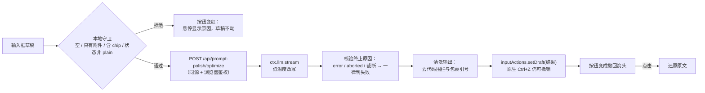

# dsh-prompt-polish

[](https://github.com/<your-account>/dsh-prompt-polish/actions/workflows/ci.yml)
[](https://www.npmjs.com/package/dsh-prompt-polish)
[](./LICENSE)
[](https://github.com/deepseek-ai/deepseek-harness)

给 [DeepSeek Harness](https://github.com/deepseek-ai/deepseek-harness)（dsh）Web 界面加一个**提示词优化按钮**：点一下，把输入框里的草稿交给模型改写成更清晰、更可执行的提示词——目标明确、要求具体、约束清楚、验收可判。按钮就在模型名旁边，用的是你当前会话已经选好的模型，结果直接写回输入框，随后按钮自己变成撤回箭头。

[English](./README.md) | 中文

---

## 为什么需要它

能让编码智能体直接开工的提示词，通常都写清了**要做什么、在哪做、有什么约束、怎么算做对了**。而大多数草稿只是随手记的几句话。这个插件给输入框加了一个**优化入口**：把草稿经一次低温度改写（走 harness 自己的 LLM 服务），把更好的版本填回输入框，原文永远只差一次点击。

它不会改变你的意图：策略只被允许把要求讲清楚，**不允许发明需求**。API key 不会进入浏览器，整个流程也从不触碰会话的模型历史。

## 功能一览

| | |
|---|---|
| ✨ **输入框按钮** | 位于工具行、模型名紧邻左侧的小星星；随行自适应，始终在手边 |
| 🔁 **一键三态** | 空闲（星星）→ 点击开始优化；进行中（转圈）→ 点击取消；完成（撤回箭头）→ 点击还原原文。不弹面板、不加提示条 |
| 🧠 **用你当前的模型** | 调用走 `ctx.llm`，路由就是你会话正在用的那条——不需要再配一个模型，也不需要单独的密钥 |
| 🧩 **路由兜底链** | 会话已用的路由 → 跨进程默认模型（`agent-default-model`）；非浏览器调用方也可显式传路由 |
| 🔑 **零凭据配置** | 调用走 harness LLM 服务，密钥来自 harness 凭据库，且只在宿主进程使用 |
| 🛡️ **草稿安全** | 空输入、只有附件、超长、含命令/引用 chip 的草稿一律提前拒绝；任何失败都不会改动你已经写下的内容 |
| ↩️ **两种撤回** | 原生 `Ctrl+Z`（写回走官方编辑器接口）＋ 按钮自身的撤回态 |
| ⚙️ **设置即时生效** | 总开关、力度、温度、token/字数上限、超时、策略提示词在「设置 → 插件配置」里改，无需重启 |
| 🌏 **语言跟随原文** | 中文进中文出、英文进英文出；代码、路径、标识符、报错原文原样保留 |
| 🚫 **不编造** | 只做表达层改写：不新增需求、不虚构事实、不替你选技术栈 |
| 🩺 **运行时诊断** | 客户端状态挂在 `window.__dshPromptPolish`（`stage` / `attempts` / `mounted` / `errors`），一条命令定位问题 |

> **本版 UI 文案只有中文**（按钮悬停如 `优化提示词` / `取消优化` / `撤回优化`，以及本地守卫提示）。
> 接入 harness 的 locale 命名空间做中英字典在计划中；设置页的字段描述也是中文，因为那是由 schema 渲染的。

## 工作原理



插件是**一个 npm 包、两半结构**，遵循 dsh 插件约定：

- **宿主半**（`exports "."`，Node）：注册 `prompt-polish` 设置命名空间（schemastery，内置插件配置页自动渲染）与共享 web 服务器上的 `POST /api/prompt-polish/optimize` 路由。模型调用走 `ctx.llm.stream`，并采用 harness 给会话标题用同一套辅助调用纪律：组合超时 + 调用方取消（流中与流后各校验一次）、终止原因校验、拒绝截断结果。
- **浏览器半**（`exports "./client"`，由 `dsh.client` 加载）：把按钮注册进 `conversation.input.right` 插槽，用 `useInput` 读草稿、用 `inputActions.setDraft` 写回，并渲染按钮三态。它**只用 session 作用域的标准 props**——原因见 [docs/compatibility.md](./docs/compatibility.md)。

两半在运行时不共享代码：浏览器半只拿到线协议类型和提示词清洗函数，所有涉及凭据的工作都在宿主半完成。

## 环境要求

| | |
|---|---|
| dsh | `>= 0.1.5-rc.1`（已在 `0.1.5-rc.1` 验证） |
| Profile | `web` —— 桌面应用与 `dsh web` 共用同一个 profile |
| Node | `^22.19.0 \|\| >=24.0.0`（仅从源码构建时需要） |
| 插件 | `0.2.x` |

宿主半声明 `inject: ['llm', 'settings']`；`webServer`、`sessions`、默认模型命名空间都是可选探测，缺失时优雅降级。

## 安装

**从本地检出安装（当前推荐）**。构建产物 `lib/` 已随仓库提交，安装方不需要构建：

```bash
git clone <本仓库> dsh-prompt-polish
cd dsh-prompt-polish
dsh plugin --profile web add .
# 然后重启 dsh web（或桌面应用）——bundle 列表在进程启动时确定
```

若要边改边调试，先构建再以 link 方式挂载：

```bash
pnpm install
pnpm run build
dsh plugin --profile web add link:C:\path\to\dsh-prompt-polish
```

**从 GitHub 直装**。`lib/` 已提交，因此不会触发构建，也不会触发 pnpm 的 `allowBuilds` 拦截：

```bash
dsh plugin --profile web add github:<your-account>/dsh-prompt-polish
# 需要可复现时锁定 commit：
dsh plugin --profile web add github:<your-account>/dsh-prompt-polish#<sha>
```

**从 tarball 安装**（不需要构建环境）：

```bash
pnpm pack                        # 产出 dsh-prompt-polish-0.2.0.tgz
dsh plugin --profile web add ./dsh-prompt-polish-0.2.0.tgz
```

**从 npm 安装**（发布后）：

```bash
dsh plugin --profile web add dsh-prompt-polish
```

**卸载：**

```bash
dsh plugin --profile web remove dsh-prompt-polish
# 然后重启 dsh web
```

`dsh plugin add` 会因为包声明了 `dsh.bundle.patch` 而自动把本包追加进 `dsh.profile.bundles`；`remove` 会把它移除。两种操作后，**运行中的 profile 仍保持启动时的 bundle 集合**，所以必须**重启**才会看到变化。

## 使用

在输入框写下草稿，然后点模型名左边的小星星。

**三种状态**

| 状态 | 图标 | 点击行为 | 悬停提示 |
|---|---|---|---|
| 空闲 | ✦ 四角星 | 开始优化 | `优化提示词` |
| 进行中 | ↻ 转圈（悬停变红） | 取消本次调用 | `取消优化` |
| 完成 | ↺ 撤回箭头（主题色） | 还原原文 | `撤回优化` |

**逐步发生的事**

1. **先跑本地守卫。** 空/纯空白草稿、只有附件的草稿（chip 尾随的零宽空格会被正确折叠掉）、超长草稿、含 `/命令` 或 `@引用` 的草稿、输入机处于非 `plain` 状态——都会被拒绝并给出悬停原因。chip 被拒绝是因为"填回纯文本"会把它们毁掉。
2. **按钮转圈，宿主调用模型。** 调用期间草稿完全不动，因此任何时刻取消都等于你什么都没做。
3. **成功后结果写回输入框**（走官方编辑器接口，原生撤销栈保持有效，`Ctrl+Z` 可用），同一个按钮变成撤回箭头。
4. **点击撤回还原原文**，按钮回到空闲。如果你在结果落地后继续打字，撤回态会自动失效，过期文本绝不会覆盖你更新的输入。

**值得知道的交互规则**

- 优化进行中按发送 → 取消本次调用，按原文发送。
- 优化进行中编辑了草稿 → 结果**不会**写回，按钮回到空闲，原因放在悬停提示里。
- 撤回入口按 `undoWindowMs` 过期（默认 60 秒）；客户端通过设置镜像读取该值，读不到时用 60 秒兜底。
- 每个会话同时只允许一次优化，被取消调用的迟到响应会按请求 id 丢弃。

## 配置

全部配置都在 `prompt-polish` 设置命名空间里，可在 **设置 → 插件配置** 编辑，或直接写 `~/.dsh/settings.yaml`。改动即时生效（`applies: 'live'`）。

默认值有三层来源，后者覆盖前者：schema 默认值 → `cordis.patch.yml` 里这一行的 `config`（组合层 base）→ 你的设置段。开箱状态下组合层已经钉住了 `enabled`、`temperature`、`maxOutputTokens`、`timeoutMs`、`maxInputChars` 五项，所以即使从不打开设置页，生效的也是下表中的默认值。

| 字段 | 默认 | 生效方式 | 说明 |
|---|---|---|---|
| `enabled` | `true` | 即时 | 总开关；关闭后隐藏按钮并停用接口 |
| `strength` | `balanced` | 下次调用 | `conservative` 只纠错与结构化；`balanced` 补全隐含前提；`aggressive` 重写成完整任务说明（长度上限放宽到约 1500 字符） |
| `temperature` | `0.3` | 下次调用 | 越低越忠实原文 |
| `maxOutputTokens` | `2048` | 下次调用 | 单次输出上限；**被截断一律拒绝写回**，所以 `aggressive` + 开启推理时要调大 |
| `maxInputChars` | `12000` | 下次调用 | 输入上限，按 Unicode 码点计数（一个 emoji 算一个字符）；超限**拒绝而不截断** |
| `timeoutMs` | `60000` | 下次调用 | 单次调用端到端超时；超时会给出独立文案，而不是笼统的失败 |
| `systemPrompt` | 空 | 下次调用 | 自定义策略文本；留空用内置策略 |
| `strategyMode` | `replace-default` | 下次调用 | `replace-default` 整体替换内置策略（内置硬性约束——保留意图、不编造、只输出正文、语言一致——**不会**自动保留）；`extend-default` 追加在内置策略之后，硬性约束继续生效 |
| `undoWindowMs` | `60000` | 即时 | 撤回入口保留时长（`0` = 不过期）；按钮通过客户端设置镜像读取 |

同样的值也可以写在用户层补丁里，不动插件代码：

```yaml
# ~/.dsh/profiles/web/cordis.patch.yml（保存即热重载）
- id: prompt-polish
  config:
    strength: aggressive
    timeoutMs: 90000
```

**模型路由优先级**（宿主侧）：

1. 请求体里的显式路由——线协议支持，非浏览器调用方可传；**随包的浏览器半刻意不传**；
2. 会话最近一次请求头里记录的路由；
3. 跨进程默认模型（`agent-default-model`）。

三者都没有时，插件返回 `unconfigured` 与可操作的提示，而不是猜一个。这也正是"全新会话、还没发过消息、又没有默认模型"时的表现。因此随包客户端的行为是：**会话模型，兜底到 harness 默认模型**。

## 错误处理与边界情况

| 情况 | 行为 |
|---|---|
| 空 / 纯空白草稿 | 本地拒绝并给悬停提示；宿主路由也会拒绝 |
| 只有附件没有正文 | 拒绝——优化会毁掉 chip |
| 含 `/命令` 或 `@引用` chip | 本地拒绝（填回会毁掉 chip） |
| 超过 `maxInputChars` | 带确切计数拒绝；**绝不自动截断** |
| 输入机处于非 `plain` 状态（提交中 / claimed / adjudicating） | 拒绝，提示"当前输入状态不允许优化" |
| 调用期间编辑了草稿 | 丢弃结果、不写回，按钮回到空闲 |
| 调用期间按了发送 | 宿主路由检测到断开并中止模型调用，原文照常发出 |
| 超时 | 映射为带配置秒数的超时提示；可重试 |
| 输出被 `maxTokens` 截断 | 拒绝，并提示调大 `maxOutputTokens` 或缩短原文 |
| 模型没返回可用文本 | 清洗后为空 → 拒绝（`upstream`）；可重试 |
| 上游模型失败 | 映射为 `upstream`，供应商原始文本作为悬停细节 |
| 设置里关闭了插件 | 按钮隐藏；路由返回 `403` |
| profile 没有 `webServer` | 宿主半只注册设置命名空间并打一行日志——headless profile 不会因此失败 |

每一条失败路径都保证输入框与你写下的内容一字不差。错误只出现在按钮上（变红 + 悬停文案），插件从不弹窗、也不弹 toast。

| 错误码 | HTTP 状态 | 含义 | 悬停文案 |
|---|---|---|---|
| `rejected` | `403 / 413 / 422` | 被拒：已关闭、请求体过大、请求体不合法、输入非法 | 宿主自己的句子（`请先输入内容` / `输入过长（n/max），请先精简` / `提示词优化已在设置中关闭`），否则 `无法优化这条输入` |
| `timeout` | `504` | 超过 `timeoutMs` | `优化超过 <timeoutMs> 毫秒未完成` |
| `aborted` | — | 调用方断开或按了发送；**不写任何响应** | `已取消优化`（按钮先回到空闲，通常看不到） |
| `unconfigured` | `409` | 无法确定模型路由，或组合里没有 `llm` | `无法确定使用哪个模型：请先在会话里选择模型` |
| `upstream` | `502` | 模型调用失败 / 上游中止 / 被截断 / 没返回可用文本 | 供应商原始报错，或 `优化结果在 token 上限处被截断…` / `模型没有返回任何文本` |
| `internal` | `500 / 502` | 插件配置非法或意外失败 | 配置错误原文，否则 `插件内部错误` |

请求还没发出就被拦下的情况由浏览器半产生，不带错误码：

| 本地守卫 | 悬停文案 |
|---|---|
| 空草稿，或只有附件 chip | `请先输入内容` |
| 含 `/命令` 或 `@引用` chip | `含 / 命令或 @ 引用的输入暂不支持优化` |
| 输入机不在 `plain` 状态 | `当前输入状态不允许优化` |
| 调用期间草稿被改动 | `优化期间草稿已改动，结果未采用` |
| 浏览器半的其它意外 | `优化失败` |

## 架构

```
dsh-prompt-polish/
├── package.json          dsh.bundle.patch（入层叠）+ dsh.client（浏览器半）+ scripts/exports
├── cordis.patch.yml      组合层：一行 insert；其 config 即设置命名空间的 base 层
├── src/
│   ├── index.ts          宿主 apply()：设置命名空间 + 路由 + 路由解析 + 错误映射
│   ├── enhancer.ts       ctx.llm.stream 调用：超时赛跑、取消、终止校验、输出清洗
│   ├── prompts.ts        内置策略（SYSTEM/USER 模板）+ 三档力度 + 输出清洗
│   ├── config.ts         schemastery schema、默认值、输入体检
│   ├── protocol.ts       线协议类型与常量（两半共享）
│   ├── http.ts           受限读体 + JSON 响应
│   └── client/
│       ├── index.tsx     浏览器半：三态按钮、撤回、插槽注册、运行时诊断
│       └── styles.ts     按钮样式（一次性注入 <style>）
├── scripts/build.mjs     esbuild：宿主 ESM + 浏览器半（模块加载器信封）
├── test/harness.mjs      离线回归：加载 client bundle 并断言"恰好一个按钮渲染"
├── types/contract.ts     针对官方 d.ts 的编译期契约断言
├── docs/compatibility.md 接口核对、实测结论、已知边界
├── examples/             overlay / 用户补丁 / 设置示例
└── lib/                  随仓库提交的构建产物（插件运行必需；GitHub 安装不构建）
```

**数据流**

```
浏览器半（React 组件）                          宿主半（Node）
  useInput(state => state.draft)                  POST /api/prompt-polish/optimize
  inputActions.setDraft(text)      ──────────▶    解析路由 → ctx.llm.stream(...)
  状态：星星 / 转圈 / 撤回箭头                    校验终止 → 清洗 → 回传
```

## 开发

**用 pnpm。** 本仓库以 pnpm 开发（`pnpm-workspace.yaml`），而 pnpm ≥ 10 默认拒绝执行依赖的安装脚本，直到被放行。esbuild 需要 postinstall 下载平台二进制，因此仓库里带了这一行放行：

```yaml
allowBuilds:
  esbuild: true
```

如果 `pnpm install` 输出 `Ignored build scripts: esbuild`，执行一次 `pnpm approve-builds`（或保留上面的 `allowBuilds`）后重装即可。

```bash
pnpm install

pnpm run build       # lib/index.js（宿主 ESM）+ lib/client.js（浏览器半）
pnpm run watch       # 增量重建
pnpm run typecheck   # 用官方 d.ts 做接口契约检查
pnpm test            # 离线回归：client bundle 恰好渲染出一个按钮
pnpm run check       # build + typecheck + test + verify:lib
pnpm run verify:lib  # 提交的 lib/ 与重新构建结果不一致时失败
```

构建后：**重启 dsh web**（宿主半与客户端 bundle 都是启动时读取），然后刷新页面。

**两个必须知道的构建约束**

1. 浏览器半**必须**使用 automatic JSX runtime（`scripts/build.mjs` 里的 `jsx: 'automatic'`）。esbuild 的 classic runtime 会生成对全局 `React` 的引用，而模块加载器从不提供它；外壳会**静默吞掉**随之而来的 `React is not defined`，症状是"注册成功但按钮永不出现"。
2. 产物头部写入的是**源码内容哈希**（不是时间戳）。相同源码产出逐字节一致的产物——这正是 `verify:lib` 有意义的前提；而任何源码改动都会改变服务端给的 `rev`，浏览器不会继续跑旧 bundle。

**运行时诊断**

```js
copy(JSON.stringify(globalThis.__dshPromptPolish))
```

`stage` 会依次经过 `module-loaded` → `styles-ready` → `slots-injected` → `registered` → `inject-face` → `rendering`；`errors` / `attempts` / `mounted` 会说明失败原因。

## 排错

| 现象 | 原因与处理 |
|---|---|
| 按钮不出现 | 没重启进程（bundle 列表在启动时确定）；`enabled` 为 false；或没跑 `pnpm run build`，缺 `lib/client.js` |
| 按钮出现两个 | `0.2.0` 之前的版本会同时注册多个插槽；升级到 `0.2.x` 并重启 |
| 提示"优化期间草稿已改动，结果未采用" | 调用期间你编辑了输入框；结果绝不覆盖更新的输入，重新点一次即可 |
| 提示"未找到可用模型" | 会话从未选过模型且没有默认模型；在模型菜单里选一次 |
| 提示"被 token 上限截断" | 调大 `maxOutputTokens` 或缩短原文 |
| 启动时插件加载失败 | 启动输出里有原始栈；常见原因是缺 `lib/` 产物，或组合里没有 `llm` / `settings` |
| 设置页看不到 prompt-polish | 该 profile 没有设置提供方（`dsh-settings-file`，由 `dsh-base` 提供），或插件层没进 `dsh.profile.bundles` |
| 按钮在，但调用报供应商错误 | 悬停里是供应商原始信息；通常是 harness 凭据库里的密钥或额度问题 |
| 改了设置好像没反应 | 命名空间注册为 `applies: 'live'`，保存后下一次调用即生效；只有 bundle 列表变化才需要重启。完全被忽略时检查设置提供方是否存在、`prompt-polish` 段是否合法 YAML |
| 想看宿主侧发生了什么 | 宿主半每次激活会打一行（`prompt-polish: 已挂载 /api/prompt-polish/optimize`）。桌面应用：`%APPDATA%\DSH Desktop\logs\host\dsh-<日期>.log`；`dsh web`：启动它的终端 |

## 安全模型

- **路由位于 `/api` 前缀下**，因此继承 harness 的浏览器信任栅栏与鉴权：API 网关会先做 Host/Origin 校验（不可信返回 `403`）与浏览器鉴权（未认证返回 `401`），插件处理器才会被调用。把路由移出 `/api` 会失去这层保护。桌面应用从同一个 profile 提供同一套 Web 应用，因此栅栏与 cookie/会话规则完全一致。
- **凭据不进入浏览器。** 浏览器半只发送草稿文本；路由解析与 `ctx.llm` 调用都在宿主进程内完成。
- **草稿会发给你配置的模型供应商**——这正是功能本身——经由 harness LLM 服务，不经过任何第三方中转。
- **结果不进入会话的模型历史。** 这是一次辅助请求，不是一轮对话。
- **不读取会话上下文。** 只发送当前草稿；本版没有 `contextAware` 模式。
- **请求体有上限**（`maxInputChars × 6 + 4096` 字节）且必须能按 JSON 解析；否则在发起模型调用前就被拒绝。

## 已知限制

| 项 | 说明 |
|---|---|
| 每会话单请求 | 客户端同时只允许一次优化；被取消调用的迟到响应按请求 id 丢弃 |
| 撤回窗口依赖设置服务 | 按钮通过客户端 `settingsScope` 镜像读取 `undoWindowMs`；组合里没有设置服务时静默退回 60 秒 |
| 无上下文感知 | 从不读取会话历史，只优化草稿本身 |
| chip 一律拒绝 | 含 `/命令` 与 `@引用` 的草稿不做改写，因为填回会毁掉 chip |
| 路由前缀是硬约束 | 除非你自己补信任校验，否则请把端点保持在 `/api` 下 |
| 旧版 dsh | 只验证过 `0.1.5-rc.1` 线；更早版本可能没有 `conversation.input.*` 插槽 |

## 常见问题

**要花钱吗？**
要——每次优化都是你自己路由上的一次计费调用。`maxOutputTokens` 约束单次成本；没有任何后台自动调用。

**能锁定某个模型，而不是跟随会话吗？**
本版不行：设计上刻意跟随会话模型。把会话模型（或 harness 默认模型）设成你想要的那个即可。

**为什么含 `/命令` 或 `@引用` 的草稿被拒绝？**
写回路径通过 `inputActions.setDraft` 设置纯文本，会毁掉那些 chip。先移除、优化、再插回。

**为什么超长草稿不自动截断？**
截断会悄悄改变你的意思。插件选择拒绝，并给出确切计数。

**在 headless / SDK profile 里能用吗？**
宿主半会激活并注册设置命名空间，为缺少 `webServer` 打一行日志，然后什么都不做——优化是浏览器侧功能。

**支持官方 DeepSeek 路由吗？**
支持。它走 `ctx.llm`，因此 harness 提供的任何供应商（DeepSeek 官方、OpenAI 兼容网关）都能用。

## 手工验收清单

安装并重启 `dsh web` 之后：

1. 设置 → 插件配置 出现 `prompt-polish` 段；浏览器控制台执行
   `copy(JSON.stringify(globalThis.__dshPromptPolish))` 应看到 `"stage":"rendering"`、
   `"registered":true`，且 `mounted` 非空。
2. 模型名左边**恰好一个**小星星按钮。
3. 空输入时按钮禁用；有效草稿点击后转圈，随后草稿被替换、按钮变成撤回箭头。
4. 点撤回箭头可还原原文；`Ctrl+Z` 同样可以。
5. 优化进行中按发送 → 调用被取消，原文照常发出。
6. 在设置里把 `enabled` 改成 false → 无需重启按钮即消失。
7. 含 `/命令` 或 `@引用` 的草稿会被拒绝并给出悬停提示。

## 致谢

插件遵循 dsh 插件族的约定：一层 bundle 补丁、一个拥有路由与设置命名空间的宿主半、一个只接触 session 作用域标准 props 的浏览器半。内置策略模板刻意逐字保留——其中的语言一致性条款与反例是长期实战总结；要改风格请用 `systemPrompt`，不要删模板里的硬性约束。

## 许可

[MIT](./LICENSE)
